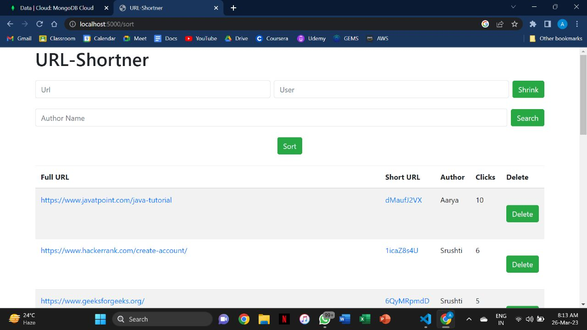

# URL_Shortener

A simple URL shortener project that allows you to shorten long URLs into shorter, more manageable links.

## Features

- Shorten long URLs into shorter, more manageable links.
- Redirect users to the original long URL when they click on the shortened URL.
- Keep track of the number of times a shortened URL has been accessed.
- Customizable configuration options to fit your requirements.

## Contact

If you have any questions, suggestions, or feedback, feel free to contact me at aaryamujumdar@gmail.com.
